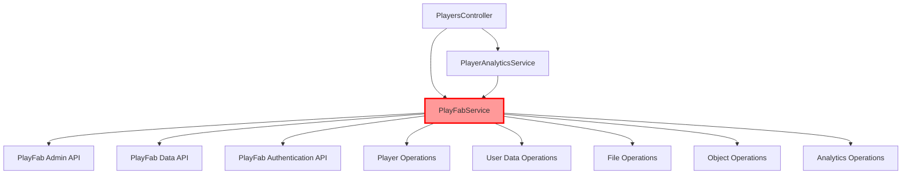
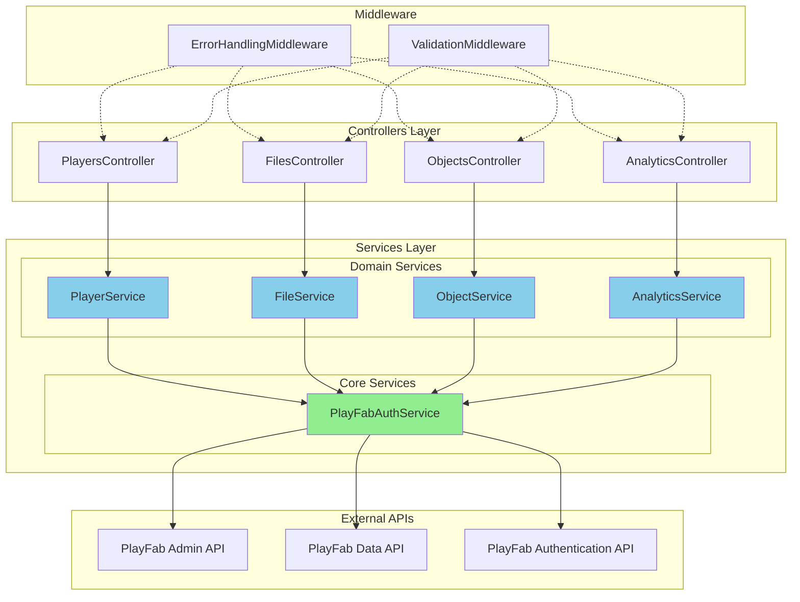
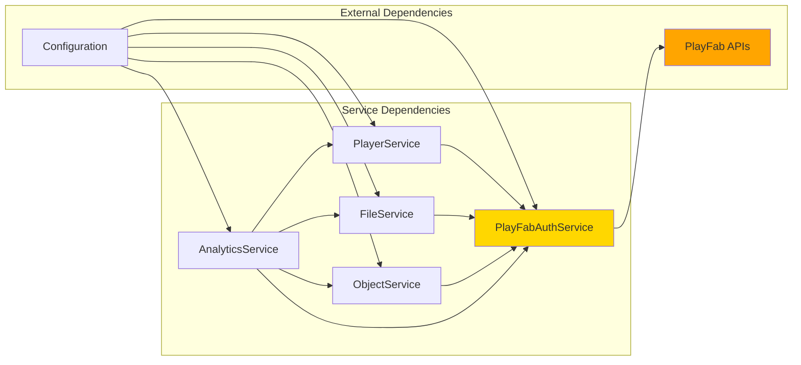
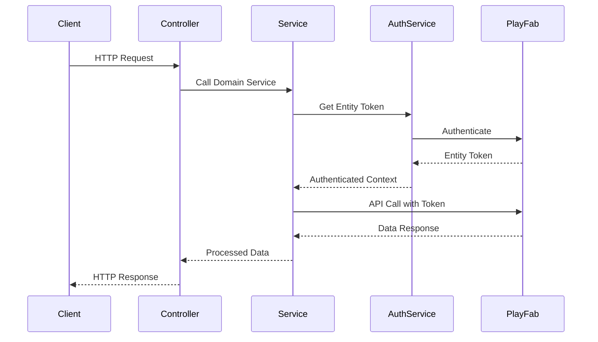
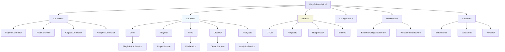
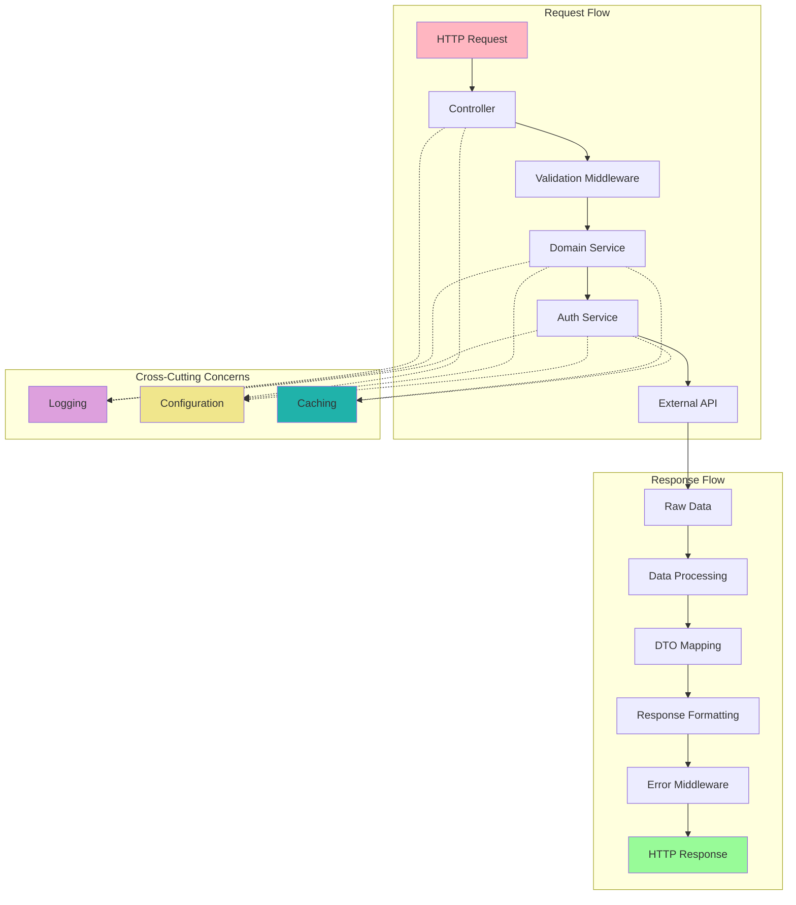

# Backend Refactoring - Architecture Diagrams

## Current Architecture (Before Refactoring)

## Proposed Architecture (After Refactoring)

## Service Dependencies

## Data Flow Architecture

## Folder Structure Diagram

## Component Interaction Model

## Benefits of Refactored Architecture

### Key Improvements:
1. **Single Responsibility**: Each service handles one domain
2. **Dependency Inversion**: Services depend on abstractions
3. **Separation of Concerns**: Clear boundaries between layers
4. **Testability**: Easy to mock and unit test
5. **Maintainability**: Clear structure for future enhancements
6. **Scalability**: Easy to add new features without affecting existing code

### Pattern Benefits:
- **Repository Pattern**: Data access abstraction
- **Service Pattern**: Business logic separation  
- **Dependency Injection**: Loose coupling
- **Middleware Pattern**: Cross-cutting concerns
- **DTO Pattern**: Clean API contracts