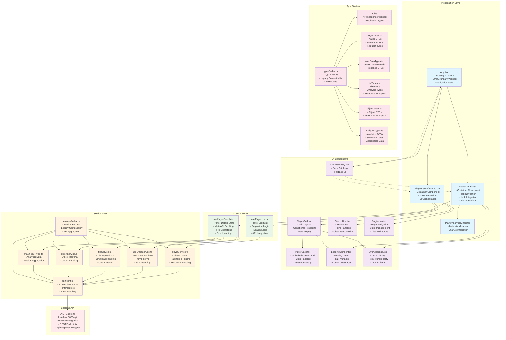
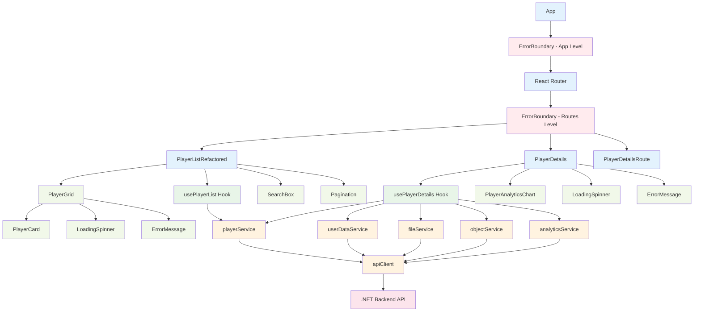
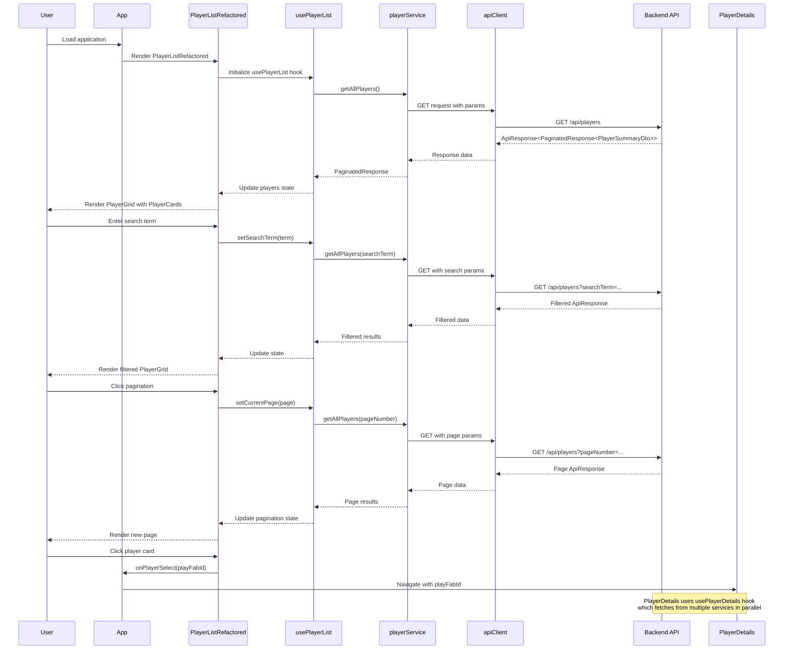

# PlayFab Analytics Frontend Architecture

## Overview
This document describes the refactored frontend architecture following Single Responsibility Principle (SRP) and clean architecture patterns.

## Architecture Diagram



## Component Hierarchy



## Data Flow Diagram



## File Organization

```
src/
├── components/
│   ├── ui/                          # Reusable UI Components (SRP)
│   │   ├── LoadingSpinner.tsx       # ✅ Loading states only
│   │   ├── LoadingSpinner.css       # ✅ Loading spinner styles
│   │   ├── ErrorMessage.tsx         # ✅ Error display only
│   │   ├── ErrorMessage.css         # ✅ Error message styles
│   │   ├── SearchBox.tsx            # ✅ Search functionality only
│   │   ├── SearchBox.css            # ✅ Search box styles
│   │   ├── Pagination.tsx           # ✅ Page navigation only
│   │   └── Pagination.css           # ✅ Pagination styles
│   ├── player/                      # Player-specific components (SRP)
│   │   ├── PlayerCard.tsx           # ✅ Individual player display only
│   │   ├── PlayerCard.css           # ✅ Player card styles
│   │   ├── PlayerGrid.tsx           # ✅ Grid layout only
│   │   └── PlayerGrid.css           # ✅ Grid layout styles
│   ├── PlayerListRefactored.tsx     # ✅ Container: orchestrates player list
│   ├── PlayerListRefactored.css     # ✅ Container styles
│   ├── PlayerDetails.tsx            # ✅ Container: uses hooks for data
│   ├── PlayerDetails.css            # ✅ Player details styles
│   ├── PlayerAnalyticsChart.tsx     # ✅ Data visualization only
│   ├── PlayerAnalyticsChart.css     # ✅ Analytics chart styles
│   ├── ErrorBoundary.tsx            # ✅ Error catching only
│   └── ErrorBoundary.css            # ✅ Error boundary styles
├── hooks/                           # Custom React hooks (SRP)
│   ├── usePlayerList.ts             # ✅ Player list state only
│   └── usePlayerDetails.ts          # ✅ Player details state only
├── services/                        # API service layer (SRP)
│   ├── apiClient.ts                 # ✅ HTTP client setup only
│   ├── playerService.ts             # ✅ Player API operations only
│   ├── userDataService.ts           # ✅ User data API operations only
│   ├── fileService.ts               # ✅ File API operations only
│   ├── objectService.ts             # ✅ Object API operations only
│   ├── analyticsService.ts          # ✅ Analytics API operations only
│   └── index.ts                     # ✅ Service exports & legacy compatibility
├── types/                           # TypeScript type definitions (SRP)
│   ├── api.ts                       # ✅ API response types only
│   ├── playerTypes.ts               # ✅ Player-related types only
│   ├── userDataTypes.ts             # ✅ User data types only
│   ├── fileTypes.ts                 # ✅ File-related types only
│   ├── objectTypes.ts               # ✅ Object types only
│   ├── analyticsTypes.ts            # ✅ Analytics types only
│   └── index.ts                     # ✅ Type exports & legacy compatibility
└── App.tsx                          # ✅ Root: routing & error boundaries
└── App.css                          # ✅ Root application styles
```

## Single Responsibility Principle Implementation

### Before Refactoring Issues:
1. **PlayerList.tsx** - Mixed concerns: data fetching, pagination, search, rendering, state management
2. **api.ts** - Single large file handling all API operations
3. **Player.ts** - All types in one file
4. **App.tsx** - Mixed routing and navigation state

### After Refactoring Benefits:

#### UI Components (Single Purpose):
- **LoadingSpinner**: Only handles loading states
- **ErrorMessage**: Only handles error display
- **SearchBox**: Only handles search input and logic
- **Pagination**: Only handles page navigation
- **PlayerCard**: Only renders individual player card
- **PlayerGrid**: Only handles grid layout and rendering

#### Custom Hooks (State Management):
- **usePlayerList**: Only manages player list state, pagination, and search
- **usePlayerDetails**: Only manages player detail data fetching and operations

#### Services (API Operations):
- **playerService**: Only handles player CRUD operations
- **userDataService**: Only handles user data operations
- **fileService**: Only handles file operations
- **objectService**: Only handles object operations
- **analyticsService**: Only handles analytics operations
- **apiClient**: Only handles HTTP client configuration

#### Types (Data Contracts):
- **api.ts**: Only API response and pagination types
- **playerTypes.ts**: Only player-related types
- **userDataTypes.ts**: Only user data types
- **fileTypes.ts**: Only file-related types
- **objectTypes.ts**: Only object types
- **analyticsTypes.ts**: Only analytics types

## Benefits of This Architecture

1. **Maintainability**: Each component has a single responsibility
2. **Reusability**: UI components can be used across different views
3. **Testability**: Isolated functions are easier to unit test
4. **Scalability**: Easy to add new features without affecting existing code
5. **Type Safety**: Organized type system with clear boundaries
6. **Developer Experience**: Clear file organization and separation of concerns
7. **Performance**: Custom hooks enable efficient state management
8. **Error Handling**: Centralized error handling with boundaries
9. **Code Reuse**: Service layer can be reused across different components
10. **Bundle Splitting**: Organized structure enables efficient code splitting

## Implementation Status

### ✅ **COMPLETED - All Legacy Code Removed**

The application now runs entirely on the new Single Responsibility Principle architecture:

1. ✅ **App.tsx**: Updated to use PlayerListRefactored and ErrorBoundary wrappers
2. ✅ **PlayerListRefactored**: Container component using usePlayerList hook
3. ✅ **PlayerDetails**: Refactored to use usePlayerDetails hook and new UI components
4. ✅ **PlayerAnalyticsChart**: Updated to use new type imports
5. ✅ **Services**: Completely reorganized into focused, single-purpose services
6. ✅ **Types**: Organized into domain-specific type files
7. ✅ **UI Components**: All reusable components following SRP
8. ✅ **Custom Hooks**: State management extracted into reusable hooks
9. ✅ **Error Handling**: ErrorBoundary components integrated throughout
10. ✅ **Build Status**: TypeScript compilation successful, no errors

### 🗑️ **Legacy Files Removed**
- ❌ `components/PlayerList.tsx` - Removed
- ❌ `components/PlayerList.css` - Removed
- ❌ `services/api.ts` - Removed
- ❌ `types/Player.ts` - Removed

### 🚀 **Production Ready**
- **TypeScript**: Zero compilation errors
- **ESLint**: All linting issues resolved  
- **Build**: Successful production build (158KB gzipped)
- **Architecture**: Complete SRP implementation
- **Error Handling**: Comprehensive error boundaries
- **Performance**: Optimized with custom hooks and efficient state management

This architecture provides a **solid, maintainable foundation** for future VR analytics features while ensuring every component has a single, clear responsibility.